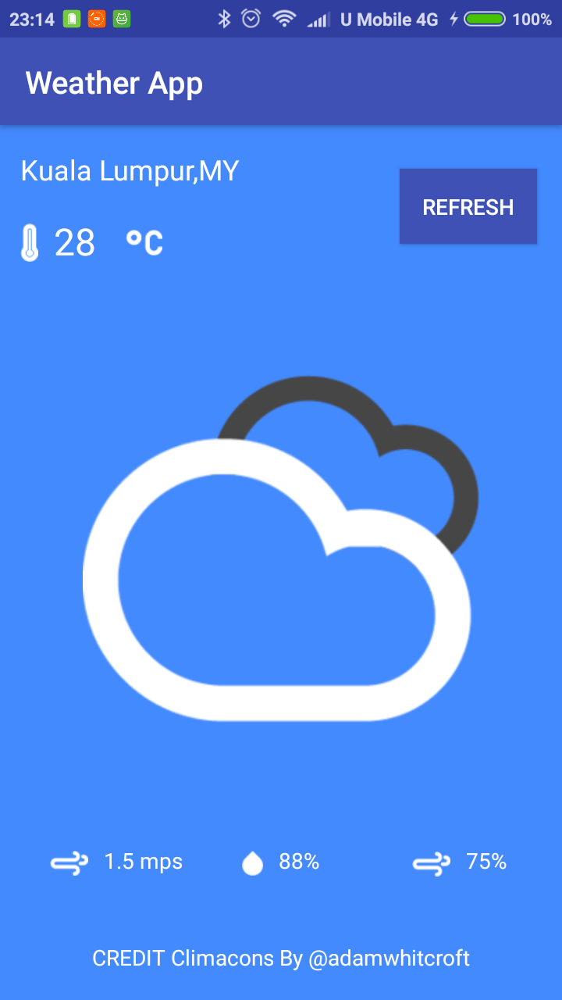

# Weather App

  

## Getting Started

This is a weather foreast mobile app that display city's temperature, humidity, wind speed, and cloudiness from [OpenWeatherMap](https://openweathermap.org/), which developed during [InfoTrek Android Development Course](https://www.info-trek.com/details/Android-Development/4776).

## Deployment

Tested on Android 6.0 mobile phone.

## Built With

[Android Studio 3.1.3](https://developer.android.com/studio/) 

## Versioning

[Semantic Versioning (SemVer) 2.0.0](http://semver.org/)

## Authors

**Jerry Chong** - [jerrychong25](https://github.com/jerrychong25)

## License

This project is licensed under the MIT License - see the [LICENSE.md](LICENSE.md) file for details
